# Anchor-relative process evaluation (APE)

**Code for "Stable correctness after impact: Evaluating collision-type recognition beyond final accuracy"**


APE measures how long a streaming collision-type classifier takes to become, and stay, correct after a published collision anchor. It does so on one fixed cohort of clips that are visible throughout the observation window.

> **Private pre-release snapshot.**
>
> - **Availability.** This repository is private now and becomes public upon acceptance of the paper. Upon acceptance, the complete package will also be deposited on ETS-Data.
> - **Licences.** The code and data licences are drafts awaiting author confirmation.
> - **Data in this repository.** It contains only key derived data. The complete derived-data package will be provided with a DOI archive (DOI: [TO BE ASSIGNED]). See [data/README.md](data/README.md) for this subset's scope, checksums and limitations.
> - **Replication.** The replication instructions in [docs/REPRODUCE.md](docs/REPRODUCE.md) describe the larger release package. `install_data.py install`, full audit recomputation and training are not supported by this subset alone.

<p align="center">
  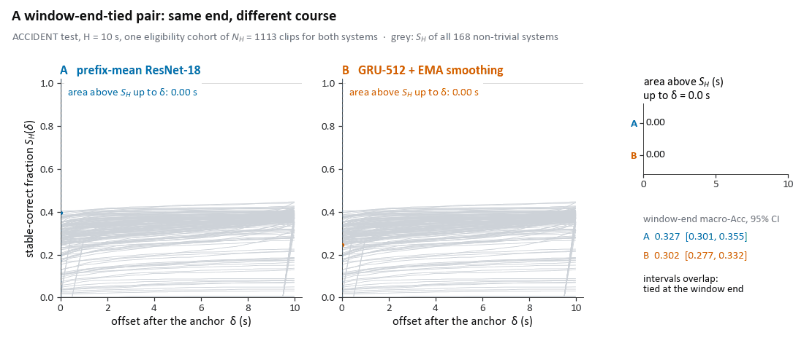
</p>

**Same end, different course.** Systems A and B are scored on the ACCIDENT test eligibility cohort at H = 10 s (N_H = 1113 clips):

- **A:** prefix-mean ResNet-18.
- **B:** GRU-512 + EMA smoothing.

The 95% intervals of their window-end macro-accuracy overlap. The area above each stable-correct curve S_H(δ) fills as the offset advances. At δ = H that area is RMSCD@10: **5.73 s for A** and **6.98 s for B**. Grey lines show S_H of all 168 non-trivial systems.

[MP4](docs/media/ape_tied_pair_rmscd.mp4) · [caption, data sources and limits](docs/media/MEDIA.md#ape_tied_pair_rmscdgif--mp4)

## What APE measures

- **Anchor-relative reading.** Answers are read on causal prefixes at offsets δ after a published collision anchor. The offsets lie on a declared grid (step Δ = 0.5 s) up to the horizon H.
- **Eligibility cohort.** At horizon H, only clips observed for at least H s after the anchor are scored. All systems share this one cohort, so no clip is scored up to its own end.
- **Stable correctness.** An answer at δ counts as stable correct only if it and every later answer up to H are correct. This is an offline reverse AND over the trajectory. S_H(δ) is the fraction of the cohort that is stable correct at δ.
- **RMSCD@H.** The restricted mean stable-correct delay is the area above S_H(δ) over [0, H]. It measures how long answers take to become and stay correct. A clip that never becomes stable within the window counts with the full window H.
- **Exact split.** On the declared grid, RMSCD splits exactly into two areas:
  - **E_H**, the error area above the cohort's accuracy curve;
  - **R_H**, the retracted-correct area spent on correct answers that are later replaced by errors.
- **Window-end accuracy.** Accuracy at δ = H, the quantity that final-accuracy evaluation reports.

<p align="center">
  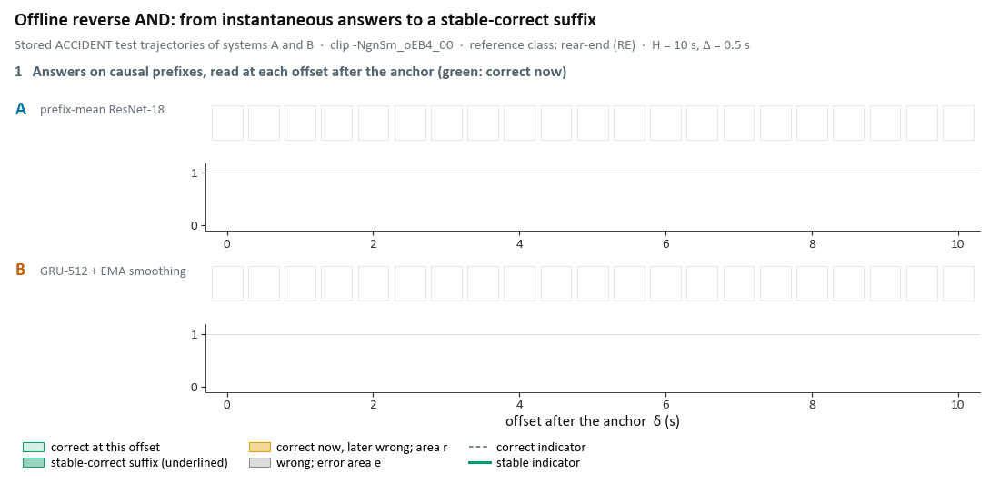
</p>

**Offline reverse AND on one stored ACCIDENT test clip (`-NgnSm_oEB4_00`, H = 10 s).**

- **A** becomes stable correct from δ = 2 s. It contributes d = 1.75 s: e = 1.00 s error area plus r = 0.75 s retracted-correct area.
- **B** is correct at some offsets but never stable within the window. It contributes the full d = 10.00 s: e = 2.75 s plus r = 7.25 s.

RMSCD is the cohort mean of these per-clip areas. This is a single clip that illustrates the mechanism; it says nothing about how often the pattern occurs.

[MP4](docs/media/ape_reverse_and.mp4) · [caption, data sources and limits](docs/media/MEDIA.md#ape_reverse_andgif--mp4)

## Why one fixed cohort

<p align="center">
  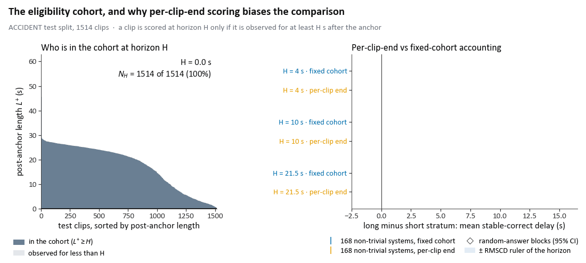
</p>

**The cohort.** Of the 1514 ACCIDENT test clips, 1328, 1113 and 742 are observed for at least 4, 10 and 21.5 s after the anchor.

**Per-clip-end scoring.** When each clip is scored up to its own end, random-answer blocks show a long-minus-short gap in mean stable-correct delay of +7.70 s and +7.84 s at H = 10 s. In other words, random answers look 7.7–7.8 s faster on short clips.

**Fixed cohort.** The same gaps are +0.03 s and +0.18 s, inside the ±0.42 s RMSCD ruler of that horizon.

[MP4](docs/media/ape_eligibility_cohort.mp4) · [caption, data sources and limits](docs/media/MEDIA.md#ape_eligibility_cohortgif--mp4)

## Qualitative cases on real footage

The paper's six qualitative cases are replayed on the real dataset frames, in sync with the stored predictions:

- **Fig. 5:** ACCIDENT test clips, systems A and B.
- **Fig. S3:** MM-AU development clips, one GRU checkpoint with input every q = 2, 4, 8 frames.

A tile and its p(reference class) point appear when the video reaches the read's offset; nothing changes between reads. The stable-correct suffix is computed offline, so it is shown only after the window. Each case ends on a held frame with the read-outs and note of the paper's panel. The cases are post hoc illustrations, not prevalence estimates.

<details>
<summary><b>Fig. 5 · ACCIDENT, systems A and B (three GIFs)</b></summary>

<p align="center">
  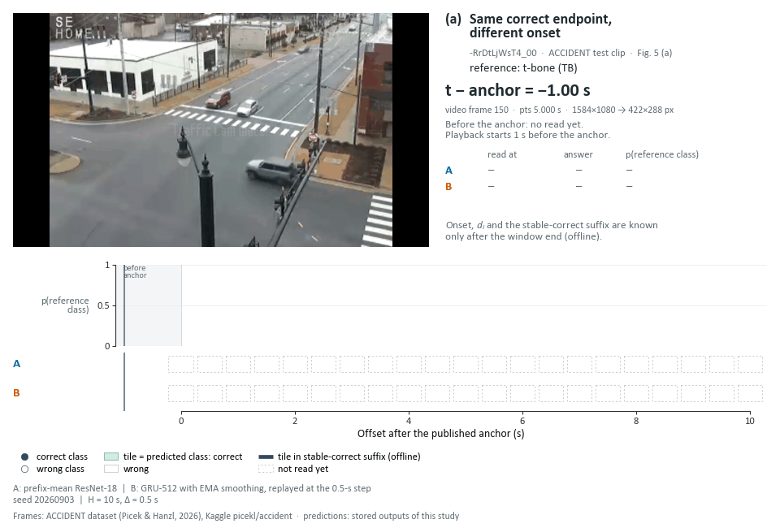
</p>

**(a) `-RrDtLjWsT4_00`, t-bone.** B answers SS until 1 s, then TB; both end on TB (A stable from 0 s, d_i = 0 s; B stable from 1.5 s, d_i = 1.25 s).

<p align="center">
  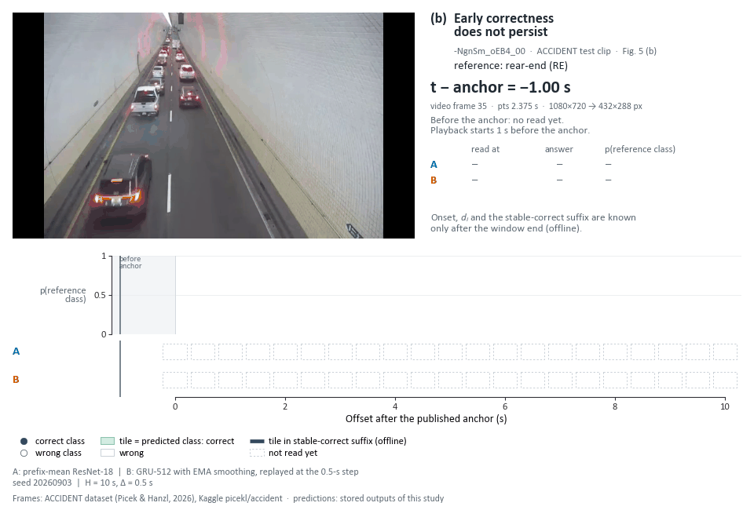
</p>

**(b) `-NgnSm_oEB4_00`, rear-end.** B is right at 0 s and from 1.5 to 8 s, then ends on SI (A stable from 2 s, d_i = 1.75 s; B never stable, d_i = 10 s).

<p align="center">
  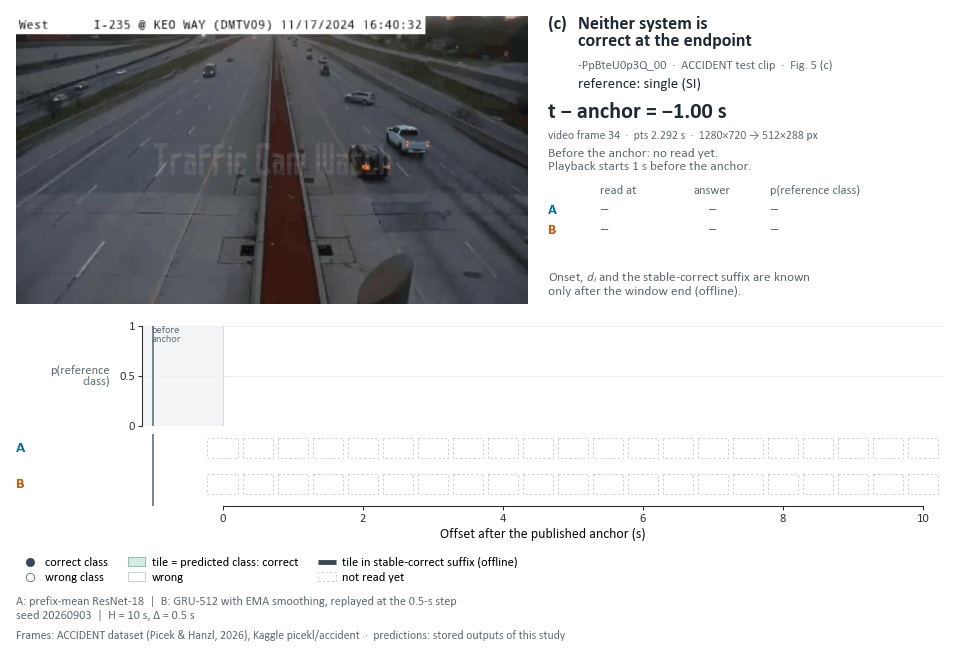
</p>

**(c) `-PpBteU0p3Q_00`, single.** Both systems predict SS at every offset (d_i = 10 s for both).

</details>

<details>
<summary><b>Fig. S3 · MM-AU development, input cadence q = 2, 4, 8 (three GIFs)</b></summary>

<p align="center">
  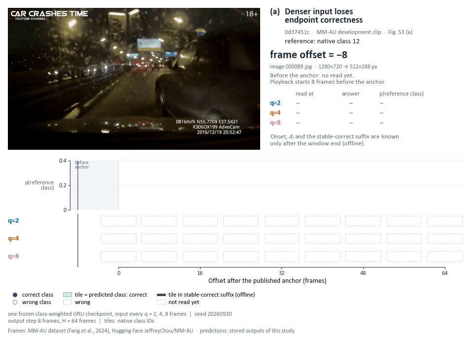
</p>

**(a) `0d37451c`, native class 12.** q=2 ends on 8; q=4 and q=8 return to 12 from 56 f.

<p align="center">
  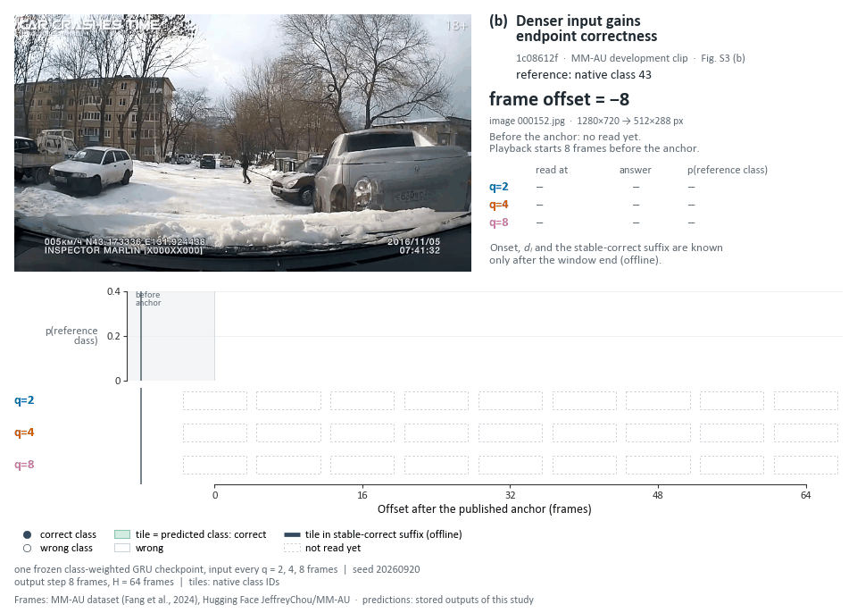
</p>

**(b) `1c08612f`, native class 43.** Only q=2 switches to 43, at the last offset.

<p align="center">
  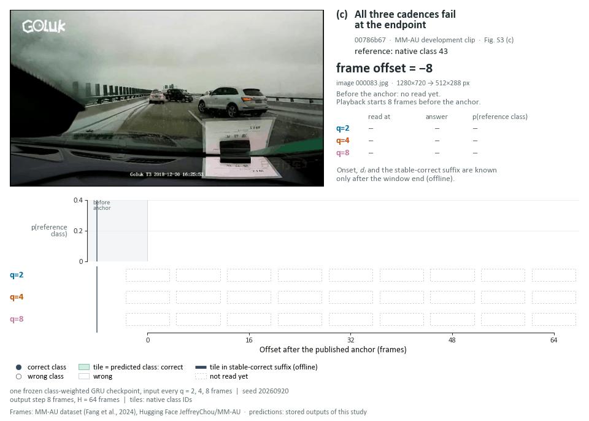
</p>

**(c) `00786b67`, native class 43.** All cadences change from 12 to 14 at 32 f.

</details>

[ACCIDENT MP4](docs/media/qual_accident_replay.mp4) · [MM-AU MP4](docs/media/qual_mmau_replay.mp4) · [caption, sources, checks, selection and limits](docs/media/MEDIA.md#qualitative-replays-on-real-footage)

**Attribution and licence.**

- **ACCIDENT frames.** ACCIDENT dataset (Picek & Hanzl, 2026), Kaggle `picekl/accident`. It is listed on Kaggle under CC BY-NC-SA 4.0; clarification from the dataset authors is pending.
- **MM-AU frames.** MM-AU dataset (Fang et al., 2024), Hugging Face `JeffreyChou/MM-AU`, under CC BY-NC 4.0.
- **Terms.** The frames are shown for non-commercial research illustration with attribution. These media files are not covered by the repository's code licence ([licence note](docs/media/MEDIA.md#licence-of-the-frames)).

## Results at a glance

<p align="center">
  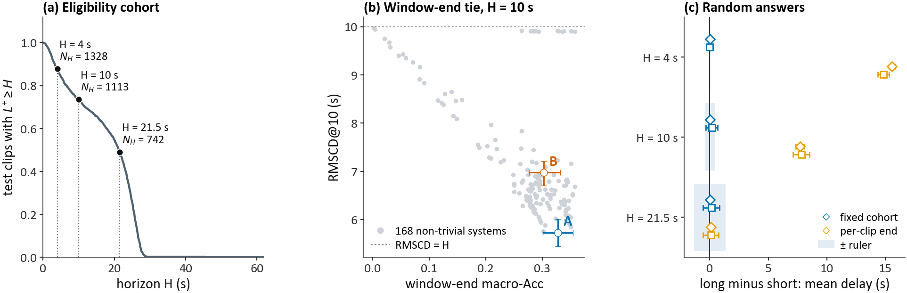
</p>

| Panel | Content |
|---|---|
| (a) | Share of ACCIDENT test clips observed for at least H s; N_H at the registered horizons. |
| (b) | Window-end macro-accuracy against RMSCD@10 for the 168 non-trivial systems, with A and B and their 95% intervals. |
| (c) | Long-minus-short gaps of the random-answer blocks, fixed cohort vs per-clip end, at H = 4, 10 and 21.5 s. |

The paper also reports two further results:

- Classifiers with nearly equal error areas differed several-fold in retracted-correct area.
- Among systems that never withhold answers, selecting by window-end accuracy instead of RMSCD lengthened held-out delay on average without raising accuracy.

The paper's quantitative figures, as written by `figures/run_all.sh` (full captions are in the paper):

<table>
  <tr>
    <td width="50%" valign="top"><a href="docs/media/paper_fig3_accounting.png">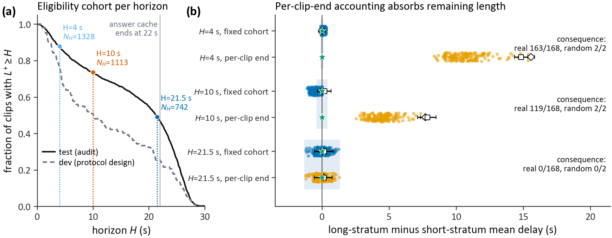</a><br><sub><b>Fig. 3</b> Eligibility and accounting</sub></td>
    <td width="50%" valign="top"><a href="docs/media/paper_fig4_tied_pairs.png">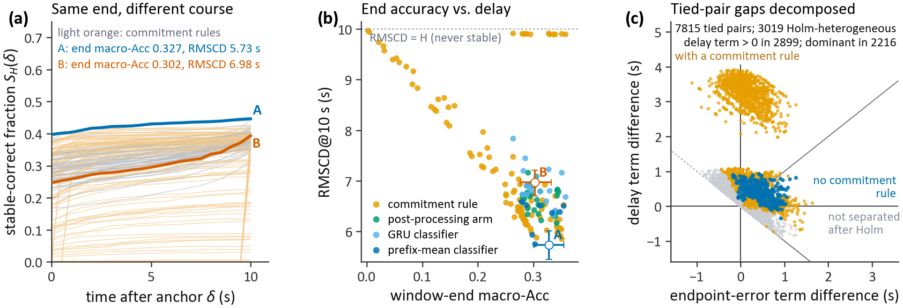</a><br><sub><b>Fig. 4</b> Window-end-tied pairs</sub></td>
  </tr>
  <tr>
    <td width="50%" valign="top"><a href="docs/media/paper_fig6_knobs.png">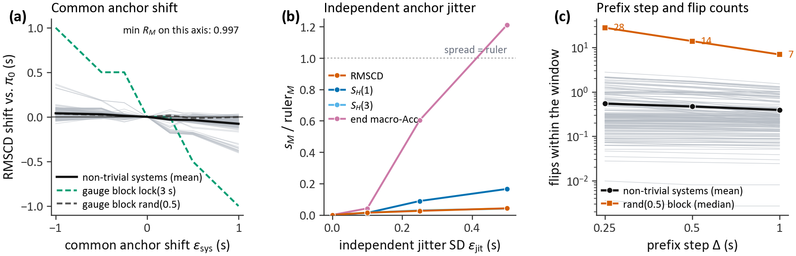</a><br><sub><b>Fig. 6</b> Protocol knobs</sub></td>
    <td width="50%" valign="top"><a href="docs/media/paper_figS1_comparability.png">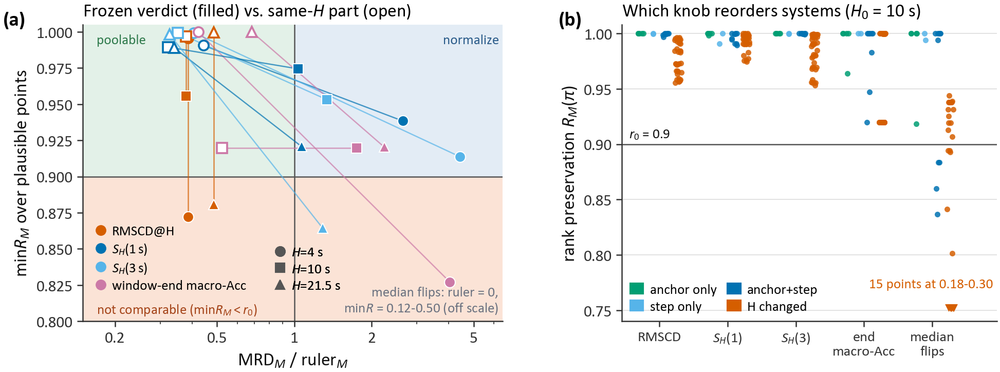</a><br><sub><b>Fig. S1</b> Comparability (ESM)</sub></td>
  </tr>
  <tr>
    <td width="50%" valign="top"><a href="docs/media/paper_figS2_mmau.png">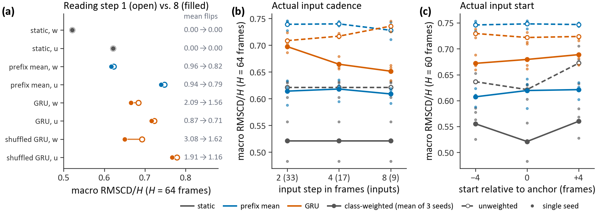</a><br><sub><b>Fig. S2</b> MM-AU development study (ESM)</sub></td>
    <td width="50%"></td>
  </tr>
</table>

Apart from the qualitative replays in [Qualitative cases on real footage](#qualitative-cases-on-real-footage), all media are drawn from stored records only and contain no dataset imagery. [docs/media/MEDIA.md](docs/media/MEDIA.md) lists for each file what it shows, which records it reads, which checks it passes and its limits.

## What is in this repository

The repository implements anchor-relative process evaluation (APE) of streaming collision-type classifiers and every computation behind the paper:

- the frozen audit on the ACCIDENT real-video subset (manifest and cohorts, 185 answer sets, gauge blocks, characterization of the metric family, gates G2 to G5, window-end-tied pairs, the VLM secondary pool);
- the re-analyses of the stored answers (E/R components, paired decomposition, sparse-output bounds, reading protocols, coverage calibration, conditional delay, selection and per-class components);
- the training-objective comparison on the development data;
- the MM-AU development study (frame-axis adapter, native nine-class task, pixel and control pilots, anchor shift, input stride, output-reading sensitivity);
- the scripts that draw the figures and tables of the article and its electronic supplementary material (ESM).

Derived data (manifests, stored answers of all systems, audit and re-analysis outputs, MM-AU predictions and evaluations) are distributed separately as the **APE derived-data package** (see [Data availability](#data-availability)). Raw videos, original dataset frames and pretrained weights are not redistributed. Scaled frames of six clips appear only in the qualitative replay media (see [Qualitative cases on real footage](#qualitative-cases-on-real-footage)).

## Quick start

These steps use the key derived-data subset in `data/`, which is enough for the paper's quantitative figures and numeric tables and for the README media. Access to the repository is restricted until it becomes public.

```bash
git clone https://github.com/WeiZhou96/Anchor-relative-Process-Evaluation.git
cd Anchor-relative-Process-Evaluation
conda env create -f environment.yml && conda activate ape       # or: python -m pip install -r requirements.txt
python scripts/release/install_data.py verify --data data        # SHA-256 check of the subset
export APE_DATA="$PWD/data"
bash figures/run_all.sh                                          # tables and quantitative figures -> figures/out/
python figures/make_media.py                                     # README media -> docs/media/ (MP4 only if ffmpeg is on PATH)
```

On PowerShell, set `APE_DATA` before invoking individual Python figure/table scripts. The shell entry point `figures/run_all.sh` requires Bash.

```powershell
$env:APE_DATA = (Resolve-Path data).Path
python figures\make_media.py
```

Set `APE_DATA` explicitly for `run_all.sh`: its default expects a separate sibling data package. `figures/make_media.py` defaults `APE_DATA` to `data/`. No data installation is required for the `figures/` entry points.

**Do not run `install_data.py install` against this subset.** That command requires the omitted `accident/outputs/answers/` directory and its complete answer index, and it may copy partial outputs before failing. `verify` supports this subset without changes.

The subset supports the quantitative figure inputs and the eight numerical/table entry points through `check_reproduce.py`. The qualitative figures need original frames. `report/make_tables.py`, `k_c_verify.py` and all answer-level audit and re-analysis entry points require additional archive inputs.

The full replication guide is in **[docs/REPRODUCE.md](docs/REPRODUCE.md)**. It covers:

- installation and the environment variables;
- the data sources: the derived-data package, ACCIDENT, MM-AU and the pretrained models;
- tests and the commands for the re-analyses, the audit and the figures;
- the map from each paper result to its code and outputs;
- the steps that need raw data or a GPU;
- seeds.

## Repository map

| Path | Content |
|---|---|
| `ape/` | APE library: protocol vectors and cohorts (`protocol.py`, `cohort.py`), scoring (`metrics.py`), calibration and rank preservation (`calib.py`), gauge blocks (`blocks.py`), statistics (`stats.py`), CLI (`cli.py`); audit stages K-a/K-b/K-c (`r2.py`, `r2b.py`, `r2c.py`); re-analyses (`method_analysis.py`, `m3_analysis.py`); MM-AU frame axis (`frame_axis.py`, `vocabulary.py`, `g0_floor.py`, `g6.py`, `g6_pipeline.py`) |
| `protocol/` | Frozen reference protocol `pi0.yaml`, its digest `pi0.frozen.json` / `pi0.frozen.sha256` |
| `prereg/` | Frozen pre-registration files S1 v1–v6, template, and the (unregistered) MM-AU G6 draft |
| `data/` | Manifest builders (`build_manifest.py`, `clusters.py`, `stats.py`, `g0_length_shift_r2.py`, ...). `data/manifest/` is filled by the data package. `data/mmau/`: MM-AU preflight, decoding, overlap audit, split constraints and native development manifest. In this snapshot, `data/` also holds the key derived-data subset (`data/accident/`, `data/mmau/deliverables/`; see [data/README.md](data/README.md)) |
| `systems/`, `configs/systems/` | System library: frozen feature extractors, training, inference, post-processing arms, commitment rules, trivial systems, the read-only VLM (`vlm_full.py`) and its pilot (`vlm_pilot/`), stage-two learning recipes (`stage2_learning.py`) |
| `scripts/` | Run-order entry points: `b_*` system library (first round), `b_r2_run.py` (second round), `a_*` first audit pass, `c_*` data track, `k_*` audit stages K-a/K-b/K-c, `method_experiments.py` (first re-analysis), `m3_*.py` (M3 re-analysis), `stage2_*.py` (calibration and training comparison), `release/install_data.py` |
| `report/` | Audit tables and internal audit figures (`make_tables.py`, `make_figs.py`, `r2*_tables.py`, `r2*_figs.py`) |
| `figures/` | Scripts for the article/ESM figures and tables, with the vendored plotting style ([figures/README.md](figures/README.md)); `make_media.py` writes the README media into `docs/media/` |
| `mmau/study/` | MM-AU development-study scripts (pixel pilot, controls, dense overlap and reading sensitivity, anchor shift, input stride) |
| `tests/` | Unit and integration tests (`python -m pytest tests data/mmau`) |
| `*.md` at the root | Analysis plans and the deviation log of the re-analyses (`EXPERIMENT_*`, `M3_SCOPE_*`, `STAGE2_*`, `DEVIATIONS.md`). Several scripts hash these files into their run records, so they stay at the root |
| `docs/REPRODUCE.md` | Replication guide: installation, environment variables, data sources, commands, map from paper results to code, raw-data and GPU steps, seeds |
| `docs/PROVENANCE.md` | Where every part of this repository and of the data package comes from; release edits |
| `docs/media/` | README animations and images, with captions, sources and limits in [`MEDIA.md`](docs/media/MEDIA.md) |

## Data availability

The paper's Replication section says: "The code of the evaluation protocol, the system library and the analyses, a replication guide and key derived data are hosted at https://github.com/WeiZhou96/Anchor-relative-Process-Evaluation (public upon acceptance). Upon acceptance, the complete package will also be deposited on ETS-Data." The three data sources are:

| Source | Content | Where |
|---|---|---|
| **Key derived-data subset** (this repository) | 635 selected source files (53,465,929 bytes), copied byte-for-byte with their original relative paths and covered by `data/SHA256SUMS` | [`data/`](data/README.md) |
| **APE derived-data package** (complete) | Manifests, stored answers of the 185 library systems, audit results, re-analysis outputs, MM-AU predictions and evaluations | DOI archive (DOI: [TO BE ASSIGNED]); upon acceptance also deposited on ETS-Data |
| **Third-party data and models** (not redistributed) | ACCIDENT videos (Kaggle `picekl/accident`), MM-AU frames (Hugging Face `JeffreyChou/MM-AU`), pretrained weights | Obtain under their own terms; see [docs/REPRODUCE.md](docs/REPRODUCE.md#data) |

Three points apply to the subset (details in [data/README.md](data/README.md)):

- **Excluded items.** The subset excludes the full answer matrices, the coarse-step answer sets and two ablation records above 50 MB.
- **Availability.** The availability of raw videos, dataset frames and model weights must not be inferred from the future derived-data archive.
- **Pending decisions.** Third-party permissions remain to be clarified before distribution. Contact and copyright holder: [TO BE CONFIRMED BY THE AUTHORS].

**Dataset imagery.** Dataset imagery appears only in the qualitative replay media, which are part of the repository:

- **Files.** `docs/media/qual_accident_1.gif` to `qual_accident_3.gif`, `qual_mmau_1.gif` to `qual_mmau_3.gif`, `qual_accident_replay.mp4` and `qual_mmau_replay.mp4`.
- **Content.** Scaled frames of three ACCIDENT clips and three MM-AU development clips, with the datasets' attribution burned into every frame.
- **Licences.**
  - ACCIDENT: listed on Kaggle under CC BY-NC-SA 4.0; clarification from the dataset authors is pending.
  - MM-AU: CC BY-NC 4.0.
  - The files are shown for non-commercial research illustration and are not covered by the repository's code licence.
- **Everything else.** No other file of this repository contains dataset imagery. The original videos and image files are not redistributed.

## Citation

**Placeholder.** The citation will be added after publication. Until then, please refer to the submitted manuscript:

```bibtex
@misc{zhou_stable_correctness_placeholder,
  title  = {Stable correctness after impact: Evaluating collision-type recognition beyond final accuracy},
  author = {Zhou, Wei and Tang, Wenjie and Xu, Jinwei and Lu, Jing and Yang, Li},
  note   = {Manuscript submitted for publication. PLACEHOLDER: venue, year and DOI to be added after publication}
}
```

## Licence

**Draft, to be confirmed by the authors.**

- **Code.** Released under the Apache License 2.0 (`LICENSE`).
- **Derived-data package.** It carries its own licence (`LICENSE-DATA` in the package; draft CC BY-NC-SA 4.0).
- **Data subset.** The subset in `data/` includes the unchanged draft data licence, [`data/LICENSE-DATA`](data/LICENSE-DATA).
- **Replication file.** `REPLICATION.md` is the replication explanatory file required by the journal.
